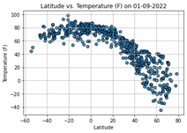
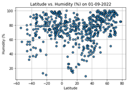
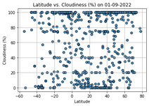
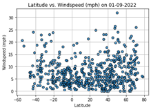

<!doctype html>
<html lang="en">

<head>
	<meta charset="utf-8">
	<meta name="viewport" content="width=device-width, initial-scale=1">
	<link rel="stylesheet" href="https://stackpath.bootstrapcdn.com/bootstrap/4.3.1/css/bootstrap.min.css"
	integrity="sha384-ggOyR0iXCbMQv3Xipma34MD+dH/1fQ784/j6cY/iJTQUOhcWr7x9JvoRxT2MZw1T" crossorigin="anonymous">
	
	
	
	<link rel="stylesheet" type="text/css" href="main.css">
	<title>WeatherPy Dashboard</title>
</head>
<body>
	

		<nav class="navbar navbar-expand-lg navbar-light bg-light">
			<a class="navbar-brand" style="background-color: rgb(255,255,255);" href="main.html">Navbar</a> 
			<button class="navbar-toggler" type="button" data-toggle="collapse" data-target="#navbarNavDropdown"
				aria-controls="navbarNavDropdown" aria-expanded="false" aria-label="Toggle navigation">
				
			</button>
			

				<ul class="navbar-nav ml-auto">
					<li class="nav-item dropdown">
						<a class="nav-link dropdown-toggle" href="#" id="navbarDropdownMenuLink" role="button" data-toggle="dropdown"
							aria-haspopup="true" aria-expanded="false">
							Visualisation Plots
						</a>
						

							<a class="dropdown-item" href="max_temperature.html">Max Temperature</a>
							<a class="dropdown-item" href="humidity.html">Humidity</a>
							<a class="dropdown-item" href="cloudiness.html">Cloudiness</a>
							<a class="dropdown-item" href="windspeed.html">Wind Speed</a>
						

					</li>
					<li class="nav-item">
						<a class="nav-link" href="comparisons.html">Comparisons</a>
					</li>
					<li class="nav-item">
						<a class="nav-link" href="data_570.html">Data</a>
					</li>
					<li class="nav-item">
						<a class="nav-link" href="https://github.com/MikeMurf/Web_-Design-Challenge.git">GitHub</a>
					</li>
				</ul>
			

		</nav>
	

	

		

			

				

					<h1 class="title">WeatherPy: Latitude Vs Weather Correlation</h1>
					

					
					
 Regression analysis was used to examine the correlation between the latitude of 570 randomly selected  cities
						and each of the following weather indicators - maximum temperature, humidity, cloudiness and wind speed.
						The results of this analysis were plotted using Matplotlib in the accompanying visualisations.
  
				

			

			

				

					<h3 class="title">Visualisations</h3>
					

					

						

							

								
Latitude vs. Max Temperature

								
							

							

								
Latitude vs. Humidity

								
							

						

						

							

								
Latitude vs. Cloudiness

								
							

							

								
Latitude vs. Wind Speed

								
							

						

					

				

			

		

	

</body>
</html>

